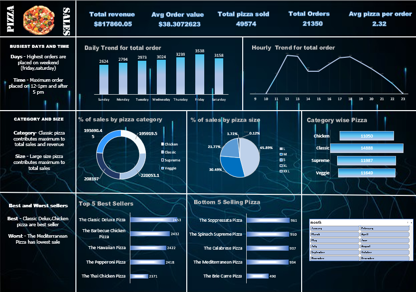

# 🍕 Pizza Sales Performance & Revenue Intelligence Dashboard

An end-to-end operational and sales analytics dashboard built in Microsoft Excel. This dashboard tracks order volumes, revenue distribution, customer ordering patterns, and product-tier performance across a retail dataset (~50,000 pizzas sold).

---

## 📌 Executive Summary & Key Metrics
- **Total Revenue:** $817.86K
- **Total Orders:** 21,350 orders
- **Total Pizzas Sold:** 49,574 units
- **Average Order Value (AOV):** $38.31
- **Average Pizzas per Order:** 2.32

---

## 🔍 Core Business Insights
1. **Peak Demand Windows:**
   - **Daily Trends:** Order volumes peak on weekends, with **Friday and Saturday** driving maximum sales.
   - **Intraday Trends:** Clear lunch rush (12:00 PM – 1:00 PM) and evening surge (5:00 PM – 8:00 PM), identifying optimal staffing windows.

2. **Category & Product Performance:**
   - **Volume Drivers:** The **Classic** category leads both revenue generation and total units sold, followed by Supreme and Chicken.
   - **Top Sellers:** The Classic Deluxe Pizza, The Barbecue Chicken Pizza, and The Hawaiian Pizza lead unit volume.
   - **Underperformers:** The Brie Carre Pizza and The Mediterranean Pizza exhibit the lowest sales velocity, indicating candidates for menu restructuring or promotions.

3. **Sizing Preferences:**
   - **Large (L)** size pizzas dominate overall sales volume, indicating consumer preference for family-sized portions.

---

## 🛠️ Technical Implementation
- **Tool:** Microsoft Excel
- **Data Transformation:** Data cleaning, type conversion, and temporal feature extraction (Day, Hour, Month) handled via Power Query.
- **Analytical Mechanics:** Pivot Tables, custom calculated fields, dynamic Slicers for multi-dimensional cross-filtering.
- **UI/Visual Design:** Dark-themed UI with KPI status cards, doughnut charts, and ranking bar graphs.

---

## 🔗 Live Interactive Dashboard
- **Live Interactive Excel:** [Click here to view on Excel Online](https://1drv.ms/x/c/64c0337877990c1d/IQABu0ftjV1_SKwv2mBA3-96AVTtW4I-ulUQ2-Ucod1cE28?e=i2suQu)
